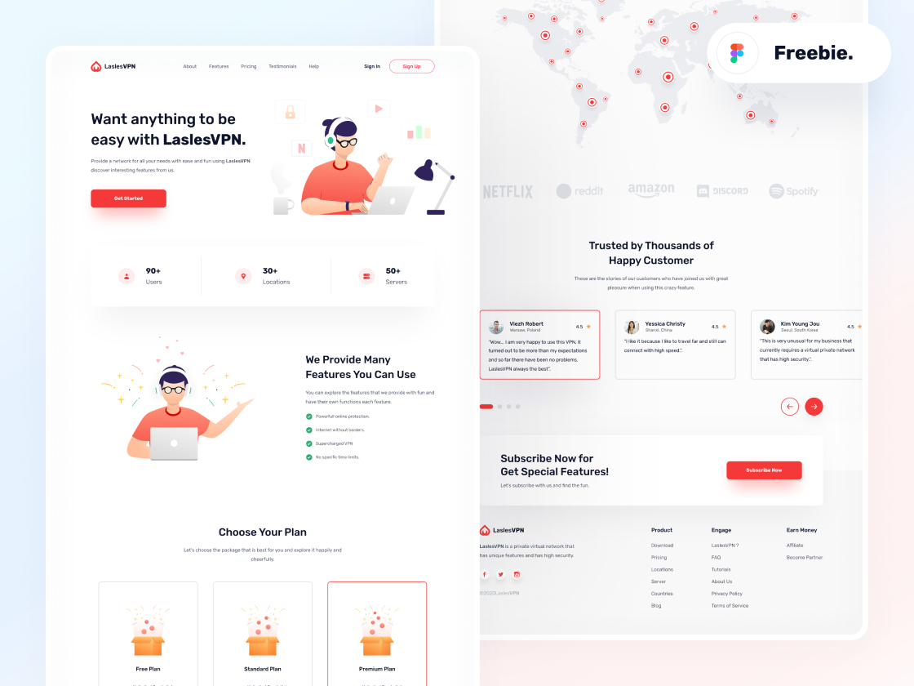

# Freebies - LaslesVPN Landing Page

I saw this beautiful design on [Dribbble](https://dribbble.com/shots/14310214--FREE-Landingpage-LaslesVPN) design by [Didi Kurniawan](https://dribbble.com/didikurniawan).



## Project setup

```
yarn install
```

### Compiles and hot-reloads for development

```
yarn serve
```

### Compiles and minifies for production

```
yarn build
```

### Lints and fixes files

```
yarn lint
```

### Customize configuration

See [Configuration Reference](https://cli.vuejs.org/config/).
